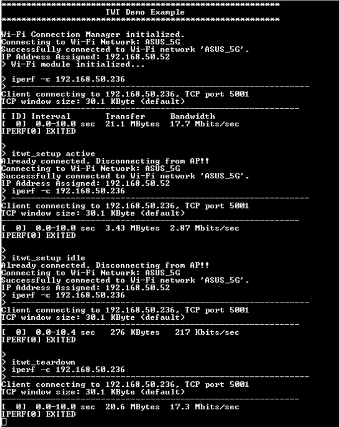
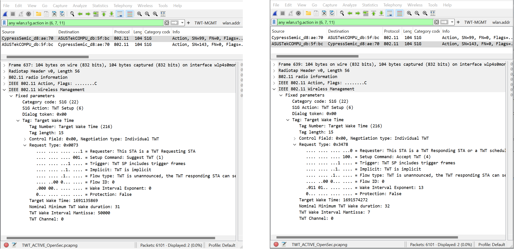
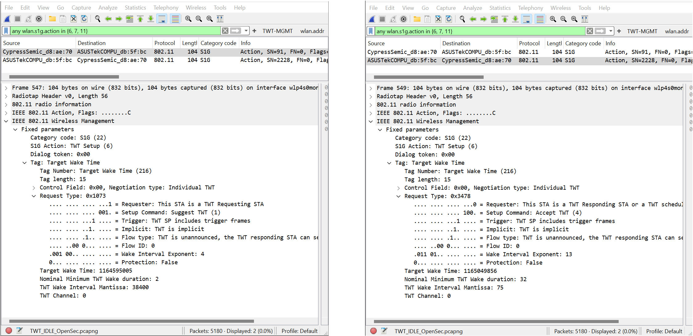

# TWT Demo

This example demonstrates how to setup an Individual TWT (iTWT) session with an AP and teardown an existing iTWT session. 

An iTWT session is established based on the TWT parameters negotiated between STA and AP. Two important parameters of iTWT Setup negotiaton are TWT Wake Interval (WI) which is the time interval between two consecutive TWT Service Periods (SP), and TWT Wake Duration (WD) which is the time duration of TWT Service Period.

[View this README on GitHub.](https://github.com/Infineon/mtb-example-threadx-wifi-twt)

[Provide feedback on this code example.](https://cypress.co1.qualtrics.com/jfe/form/SV_1NTns53sK2yiljn?Q_EED=eyJVbmlxdWUgRG9jIElkIjoiQ0UyNDA3MTQiLCJTcGVjIE51bWJlciI6IjAwMi00MDcxNCIsIkRvYyBUaXRsZSI6IlRXVCBEZW1vIiwicmlkIjoiaW5ha29sbHUiLCJEb2MgdmVyc2lvbiI6IjEuMC4wIiwiRG9jIExhbmd1YWdlIjoiRW5nbGlzaCIsIkRvYyBEaXZpc2lvbiI6Ik1DRCIsIkRvYyBCVSI6IklDVyIsIkRvYyBGYW1pbHkiOiJXSUZJIn0=)


## Requirements

- [ModusToolbox&trade;](https://www.infineon.com/modustoolbox) v3.2 or later (tested with v3.2)
- Board support package (BSP) minimum required version: 1.0.0
- Programming language: C
- Associated parts: CYW955913EVK-01


## Supported toolchains (make variable 'TOOLCHAIN')

- GNU Arm&reg; Embedded Compiler v11.3.1 (`GCC_ARM`) – Default value of `TOOLCHAIN`


## Supported kits (make variable 'TARGET')

- [CYW955913EVK-01 Wi-Fi Bluetooth&reg; Prototyping Kit](https://www.infineon.com/CYW955913EVK-01) (`CYW955913EVK-01`)


## Hardware setup

This example uses the board's default configuration. See the kit user guide to ensure that the board is configured correctly.


## Software setup

- Install a terminal emulator if you don't have one. Instructions in this document use [Tera Term](https://teratermproject.github.io/index-en.html).

- Setting up iPerf on the host
   - [iPerf 2.0.13](https://sourceforge.net/projects/iperf2/files/) (supported on Ubuntu, macOS, and Windows)
   - Go to the iPerf installation directory and launch the terminal (command prompt for Windows, terminal shell for macOS or Ubuntu).


## Using the code example

### Create the project

The ModusToolbox&trade; tools package provides the Project Creator as both a GUI tool and a command line tool.

<details><summary><b>Use Project Creator GUI</b></summary>

1. Open the Project Creator GUI tool.

   There are several ways to do this, including launching it from the dashboard or from inside the Eclipse IDE. For more details, see the [Project Creator user guide](https://www.infineon.com/ModusToolboxProjectCreator) (locally available at *{ModusToolbox&trade; install directory}/tools_{version}/project-creator/docs/project-creator.pdf*).

2. On the **Choose Board Support Package (BSP)** page, select a kit supported by this code example. See [Supported kits](#supported-kits-make-variable-target).

   > **Note:** To use this code example for a kit not listed here, you may need to update the source files. If the kit does not have the required resources, the application may not work.

3. On the **Select Application** page:

   a. Select the **Applications(s) Root Path** and the **Target IDE**.

   > **Note:** Depending on how you open the Project Creator tool, these fields may be pre-selected for you.

   b.	Select this code example from the list by enabling its check box.

   > **Note:** You can narrow the list of displayed examples by typing in the filter box.

   c. (Optional) Change the suggested **New Application Name** and **New BSP Name**.

   d. Click **Create** to complete the application creation process.

</details>

<details><summary><b>Use Project Creator CLI</b></summary>

The 'project-creator-cli' tool can be used to create applications from a CLI terminal or from within batch files or shell scripts. This tool is available in the *{ModusToolbox&trade; install directory}/tools_{version}/project-creator/* directory.

Use a CLI terminal to invoke the 'project-creator-cli' tool. On Windows, use the command-line 'modus-shell' program provided in the ModusToolbox&trade; installation instead of a standard Windows command-line application. This shell provides access to all ModusToolbox&trade; tools. You can access it by typing "modus-shell" in the search box in the Windows menu. In Linux and macOS, you can use any terminal application.

The following example clones the "[Hello world](https://github.com/Infineon/mtb-example-psoc6-hello-world)" application with the desired name "MyHelloWorld" configured for the *CY8CPROTO-062S2-43439* BSP into the specified working directory, *C:/mtb_projects*:

   ```
   project-creator-cli --board-id CYW955913EVK-01 --app-id mtb-example-threadx-wifi-twt --user-app-name WifiTwt --target-dir "C:/mtb_projects"
   ```

The 'project-creator-cli' tool has the following arguments:

Argument | Description | Required/optional
---------|-------------|-----------
`--board-id` | Defined in the <id> field of the [BSP](https://github.com/Infineon?q=bsp-manifest&type=&language=&sort=) manifest | Required
`--app-id`   | Defined in the <id> field of the [CE](https://github.com/Infineon?q=ce-manifest&type=&language=&sort=) manifest | Required
`--target-dir`| Specify the directory in which the application is to be created if you prefer not to use the default current working directory | Optional
`--user-app-name`| Specify the name of the application if you prefer to have a name other than the example's default name | Optional

> **Note:** The project-creator-cli tool uses the `git clone` and `make getlibs` commands to fetch the repository and import the required libraries. For details, see the "Project creator tools" section of the [ModusToolbox&trade; tools package user guide](https://www.infineon.com/ModusToolboxUserGuide) (locally available at {ModusToolbox&trade; install directory}/docs_{version}/mtb_user_guide.pdf).

</details>


### Open the project

After the project has been created, you can open it in your preferred development environment.


<details><summary><b>Eclipse IDE</b></summary>

If you opened the Project Creator tool from the included Eclipse IDE, the project will open in Eclipse automatically.

For more details, see the [Eclipse IDE for ModusToolbox&trade; user guide](https://www.infineon.com/MTBEclipseIDEUserGuide) (locally available at *{ModusToolbox&trade; install directory}/docs_{version}/mt_ide_user_guide.pdf*).

</details>


<details><summary><b>Visual Studio (VS) Code</b></summary>

Launch VS Code manually, and then open the generated *{project-name}.code-workspace* file located in the project directory.

For more details, see the [Visual Studio Code for ModusToolbox&trade; user guide](https://www.infineon.com/MTBVSCodeUserGuide) (locally available at *{ModusToolbox&trade; install directory}/docs_{version}/mt_vscode_user_guide.pdf*).

</details>


<details><summary><b>Keil µVision</b></summary>

Double-click the generated *{project-name}.cprj* file to launch the Keil µVision IDE.

For more details, see the [Keil µVision for ModusToolbox&trade; user guide](https://www.infineon.com/MTBuVisionUserGuide) (locally available at *{ModusToolbox&trade; install directory}/docs_{version}/mt_uvision_user_guide.pdf*).

</details>


<details><summary><b>IAR Embedded Workbench</b></summary>

Open IAR Embedded Workbench manually, and create a new project. Then select the generated *{project-name}.ipcf* file located in the project directory.

For more details, see the [IAR Embedded Workbench for ModusToolbox&trade; user guide](https://www.infineon.com/MTBIARUserGuide) (locally available at *{ModusToolbox&trade; install directory}/docs_{version}/mt_iar_user_guide.pdf*).

</details>


<details><summary><b>Command line</b></summary>

If you prefer to use the CLI, open the appropriate terminal, and navigate to the project directory. On Windows, use the command-line 'modus-shell' program; on Linux and macOS, you can use any terminal application. From there, you can run various `make` commands.

For more details, see the [ModusToolbox&trade; tools package user guide](https://www.infineon.com/ModusToolboxUserGuide) (locally available at *{ModusToolbox&trade; install directory}/docs_{version}/mtb_user_guide.pdf*).

</details>


## Operation

1. Connect the board to your PC using the provided USB cable through the KitProg3 USB connector.

2. Modify the `WIFI_SSID` and `WIFI_KEY` macros in *main.c* to match with those of the Wi-Fi network that you want to connect to.

3. Modify the `WIFI_SECURITY` macro in *main.c* to match the Wi-Fi Security Mode of the router.
   
   By default `WIFI_SECURITY` is set to `CY_WCM_SECURITY_WPA2_AES_PSK`. Refer to *cy_wcm.h* for different security modes.

4. To join a Wi-Fi network of a specific band, update the `WIFI_BAND` macro in *main.c* as follows:

   `CY_WCM_WIFI_BAND_2_4GHZ` : 2.4-GHz band
   
   `CY_WCM_WIFI_BAND_5GHZ`   : 5-GHz band
   
   By default `WIFI_BAND` is set to `CY_WCM_WIFI_BAND_ANY`

5. Open a terminal program and select the KitProg3 COM port. Set the serial port parameters to 8N1 and 115200 baud.

6. Program the board using one of the following and reset the board:

   <details><summary><b>Using Eclipse IDE for ModusToolbox&trade; software</b></summary>

      1. Select the application project in the Project Explorer.

      2. In the **Quick Panel**, scroll down, and click **\<Application Name> Program**.
   </details>

   <details><summary><b>Using CLI</b></summary>

     From the terminal, execute the `make program` command to build and program the application using the default toolchain to the default target. The default toolchain and target are specified in the application's Makefile but you can override those values manually:
      ```
      make program TARGET=APP_<BSP> TOOLCHAIN=<toolchain>
      ```

      Example:
      ```
      make program TARGET=APP_CYW955913EVK-01 TOOLCHAIN=GCC_ARM
      ```
   </details>
7. The application connects to the configured Wi-Fi access point (AP) and obtains the IP address. When the device is ready, the `>` prompt appears.

8. Run iperf for throughput result without TWT enabled. After this, use itwt_setup active/idle to setup iTWT session based on specified profile. Run iperf after setting up iTWT session of both profiles. You can use itwt_teardown to teardown existing TWT session. To verify that session is teardown, run iperf again and observe that throughput result is in the range of the result without TWT enabled. See [Running iPerf client and server against a remote peer device](https://github.com/Infineon/command-console#iperf-command) for info on iperf commands.

   **Figure 1. Terminal output**

   

**Note.** AP used for the results in the terminal output is ASUS RT-AX88U and the above throughput results are just for reference. You may or may not get the exact values depending on your testing environment. 


## Debugging

You can debug the example to step through the code. In the IDE, use the **\<Application Name> Attach (KitProg3_MiniProg4)** configuration in the **Quick Panel**. For details, see the "Program and debug" section in the [Eclipse IDE for ModusToolbox&trade; software user guide](https://www.infineon.com/MTBEclipseIDEUserGuide).


## Design and implementation

The main function initializes the hardware and sets up console task. The console task connects the device to configured AP and initializes commond console library. After this, console task waits indifinitely for user to enter commands on the terminal and the application performs the action as per the command entered by the user. 

Wi-Fi connection manager (WCM) defines two TWT profiles - 

1. Active profile where device sleeps for shorter duration and wakes up frequently (small Wake Interval)
2. Idle profile where device sleeps for a longer period of time (large Wake Interval)

``````
Warning: The maximum supported TWT wake interval is 8 secs. If a wake interval of greater than 8 secs is set, STA could disconnect from AP.
``````

### Understanding the iPerf throughput results with TWT enabled 

TWT setup parameters that are negotiated between STA and AP can be viewed by capturing the TWT Setup action frames using tools like wireshark. For the throughput results in terminal output, the negotiated TWT setup parameters are as follows -

**Figure 2. Active profile negotiated parameters**



**Figure 3. Idle profile negotiated parameters**



**Note:** AP can accept the TWT session with parameters different from the ones suggested by STA.

In the above figures, left side frame is Suggest TWT Setup frame from STA and right side frame is Accept TWT Setup frame from AP. We can observe that STA suggested a Wake Duration of 2 time units in idle profile but AP accepted the TWT session with 32 TU as Wake Duration. WI and WD are calculated as follows -

WI (in us) = mantissa * 2 ^ exponent 

WD (in us) = WD * 256 

Example:

For above active profile accepted parameters, WI = 7 * 2^13 us ~= 57 ms and WD = 32 * 256 us = 8.2 ms

For above idle profile accepted parameters, WI = 75 * 2^13 us ~= 614 ms and WD = 32 * 256 us = 8.2 ms

From the terminal output, throughput without enabling TWT is ~ 17.5 Mbps. When TWT is enabled (either active or idle profile), device sleeps for a certain period of time periodically throughput the 10s of iperf test duration and hence the throughput is reduced. For active profile, device is active for a total time of ~ 1.262s/10s (factor - 0.1262)  and is sleeping for the remaining time. Similarly for idle profile, active time is ~ 131.2ms/10s (factor - 0.0131). From active to idle profile, sleep time is increased or active time is decreased by a factor of 10 and hence the throughput reduces by the same factor.

Theoritical throughput for active profile = 0.1262 * 17.5 Mbps ~= 2.20 Mbps (Active profile throughput from terminal output is 2.87 Mbps)

Theoritical throughput for idle profile = 0.0131 * 17.5 Mbps ~= 229 Kbps (Idle profile throughput from terminal output is  217 Kbps)

**Note:** For power measurement captures with TWT enabled, please refer to AN239828 app note.


### Resources and settings

**Table 1. Application resources**

 Resource  |  Alias/object     |    Purpose
 :-------- | :-------------    | :------------
 UART (HAL) |cy_retarget_io_uart_obj | UART HAL object used by Retarget-IO for the Debug UART port

<br>


## Related resources

Resources  | Links
-----------|----------------------------------
Device documentation | Contact infineon sales for device documentation
Development kits | Contact infineon sales for kit samples
Libraries on GitHub  | [mtb-pdl-cat5](https://github.com/Infineon/mtb-pdl-cat5) – CYW55913 peripheral driver library (PDL)  <br /> [mtb-hal-cat5](https://github.com/Infineon/mtb-hal-cat5) – Hardware abstraction layer (HAL) library <br /> [retarget-io](https://github.com/Infineon/retarget-io) – Utility library to retarget STDIO messages to a UART port
Tools  | [Eclipse IDE for ModusToolbox&trade; software](https://www.infineon.com/modustoolbox) – ModusToolbox&trade; software is a collection of easy-to-use software and tools enabling rapid development with Infineon MCUs, covering applications from embedded sense and control to wireless and cloud-connected systems using AIROC&trade; Wi-Fi and Bluetooth&reg; connectivity devices.

<br>


## Other resources

Infineon provides a wealth of data at [www.infineon.com](https://www.infineon.com) to help you select the right device, and quickly and effectively integrate it into your design.


## Document history

Document title: *CE240714* - *MTB-EXAMPLE-THREADX-WIFI-TWT*

 Version | Description of change
 ------- | ---------------------
 1.0.0   | New code example
<br />

---------------------------------------------------------

© Cypress Semiconductor Corporation, 2020-2024. This document is the property of Cypress Semiconductor Corporation, an Infineon Technologies company, and its affiliates ("Cypress").  This document, including any software or firmware included or referenced in this document ("Software"), is owned by Cypress under the intellectual property laws and treaties of the United States and other countries worldwide.  Cypress reserves all rights under such laws and treaties and does not, except as specifically stated in this paragraph, grant any license under its patents, copyrights, trademarks, or other intellectual property rights.  If the Software is not accompanied by a license agreement and you do not otherwise have a written agreement with Cypress governing the use of the Software, then Cypress hereby grants you a personal, non-exclusive, nontransferable license (without the right to sublicense) (1) under its copyright rights in the Software (a) for Software provided in source code form, to modify and reproduce the Software solely for use with Cypress hardware products, only internally within your organization, and (b) to distribute the Software in binary code form externally to end users (either directly or indirectly through resellers and distributors), solely for use on Cypress hardware product units, and (2) under those claims of Cypress's patents that are infringed by the Software (as provided by Cypress, unmodified) to make, use, distribute, and import the Software solely for use with Cypress hardware products.  Any other use, reproduction, modification, translation, or compilation of the Software is prohibited.
<br>
TO THE EXTENT PERMITTED BY APPLICABLE LAW, CYPRESS MAKES NO WARRANTY OF ANY KIND, EXPRESS OR IMPLIED, WITH REGARD TO THIS DOCUMENT OR ANY SOFTWARE OR ACCOMPANYING HARDWARE, INCLUDING, BUT NOT LIMITED TO, THE IMPLIED WARRANTIES OF MERCHANTABILITY AND FITNESS FOR A PARTICULAR PURPOSE.  No computing device can be absolutely secure.  Therefore, despite security measures implemented in Cypress hardware or software products, Cypress shall have no liability arising out of any security breach, such as unauthorized access to or use of a Cypress product. CYPRESS DOES NOT REPRESENT, WARRANT, OR GUARANTEE THAT CYPRESS PRODUCTS, OR SYSTEMS CREATED USING CYPRESS PRODUCTS, WILL BE FREE FROM CORRUPTION, ATTACK, VIRUSES, INTERFERENCE, HACKING, DATA LOSS OR THEFT, OR OTHER SECURITY INTRUSION (collectively, "Security Breach").  Cypress disclaims any liability relating to any Security Breach, and you shall and hereby do release Cypress from any claim, damage, or other liability arising from any Security Breach.  In addition, the products described in these materials may contain design defects or errors known as errata which may cause the product to deviate from published specifications. To the extent permitted by applicable law, Cypress reserves the right to make changes to this document without further notice. Cypress does not assume any liability arising out of the application or use of any product or circuit described in this document. Any information provided in this document, including any sample design information or programming code, is provided only for reference purposes.  It is the responsibility of the user of this document to properly design, program, and test the functionality and safety of any application made of this information and any resulting product.  "High-Risk Device" means any device or system whose failure could cause personal injury, death, or property damage.  Examples of High-Risk Devices are weapons, nuclear installations, surgical implants, and other medical devices.  "Critical Component" means any component of a High-Risk Device whose failure to perform can be reasonably expected to cause, directly or indirectly, the failure of the High-Risk Device, or to affect its safety or effectiveness.  Cypress is not liable, in whole or in part, and you shall and hereby do release Cypress from any claim, damage, or other liability arising from any use of a Cypress product as a Critical Component in a High-Risk Device. You shall indemnify and hold Cypress, including its affiliates, and its directors, officers, employees, agents, distributors, and assigns harmless from and against all claims, costs, damages, and expenses, arising out of any claim, including claims for product liability, personal injury or death, or property damage arising from any use of a Cypress product as a Critical Component in a High-Risk Device. Cypress products are not intended or authorized for use as a Critical Component in any High-Risk Device except to the limited extent that (i) Cypress's published data sheet for the product explicitly states Cypress has qualified the product for use in a specific High-Risk Device, or (ii) Cypress has given you advance written authorization to use the product as a Critical Component in the specific High-Risk Device and you have signed a separate indemnification agreement.
<br>
Cypress, the Cypress logo, and combinations thereof, ModusToolbox, PSoC, CAPSENSE, EZ-USB, F-RAM, and TRAVEO are trademarks or registered trademarks of Cypress or a subsidiary of Cypress in the United States or in other countries. For a more complete list of Cypress trademarks, visit www.infineon.com. Other names and brands may be claimed as property of their respective owners.
